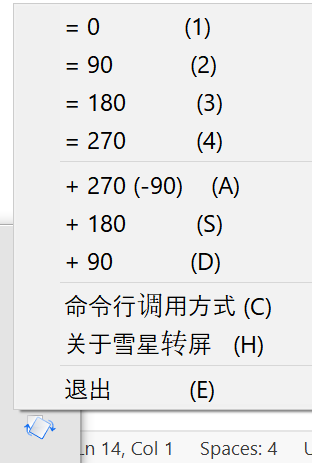
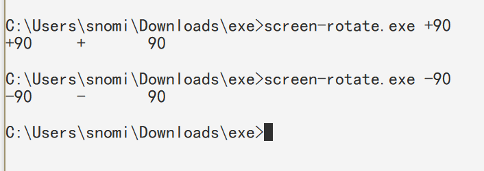

# Snowstar Rotate Screen

rotate my ALL screens then I can play computer games on bed at winter. ~\\(≧▽≦)/~

## Install

1. [Download from Latest Release](https://github.com/snomiao/snowstar-rotate-screen/releases/)

2. unzip

## Usages

### Run by tray menu

1. Run this exe

 

2. use by menu

### Run by cmd line

## Author

snomiao <snomiao@gmail.com>

(c) 2024

## License

MIT